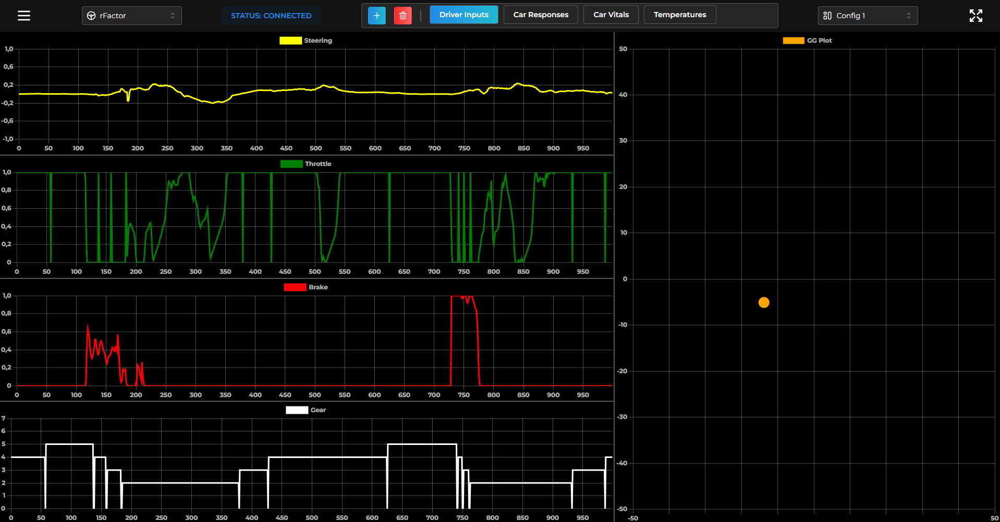

# 🏎️ RaceMetrics

A powerful real-time telemetry visualization tool for racing simulators. Transform your racing data into actionable insights with our sophisticated analysis platform. (source code not available, closed-source app, currently in development)

<div align="center">


</div>

## 🌟 Features

-   📊 **Real-time Data Visualization**: Live telemetry data from your simulator
-   📈 **Multiple Chart Types**:
    -   📉 Line Charts for time-series analysis
    -   🎯 Scatter Charts for correlation studies
    -   📋 KPI Tables for quick insights
    -   ⏱️ Detailed Lap Times Tables
    -   🗺️ Interactive Trackmap visualization
-   🎨 **Customizable Dashboard**: Create and save your preferred layouts
-   🔧 **Signal Processing**: Create custom signals by combining data streams
-   🔐 **User Authentication**: Secure your personal racing data

## 🔧 Prerequisites

-   🎮 Compatible racing simulator (currently supports rFactor with rFactorTelemetryPlugin)
-   💻 Windows operating system
-   ⚡ Node.js 18.0 or higher
-   📦 npm or yarn

## 🚀 Technologies

-   ⚛️ React + TypeScript
-   ⚡ Vite
-   🎨 Tailwind CSS
-   🎯 shadcn/ui
-   🖥️ Electron
-   📊 Chart.js

## 💻 Installation (NOT CURRENTLY AVAILABLE)

1. Download the latest release from our releases page

2. Install the rFactorTelemetryPlugin in your simulator:

```bash
# Follow installation instructions in the plugin documentation
```

3. Run the RaceMetrics installer

4. Launch and configure:
    - Start RaceMetrics
    - Create your account
    - Configure your preferred layout
    - Start racing!

## 📸 Screenshots

### Charts Dashboard



## 💬 Support

Need help? We've got you covered:

1. 📚 Check our documentation
2. 📧 Contact our support team

## 🙏 Acknowledgments

-   🏁 Thanks to the rFactor community
